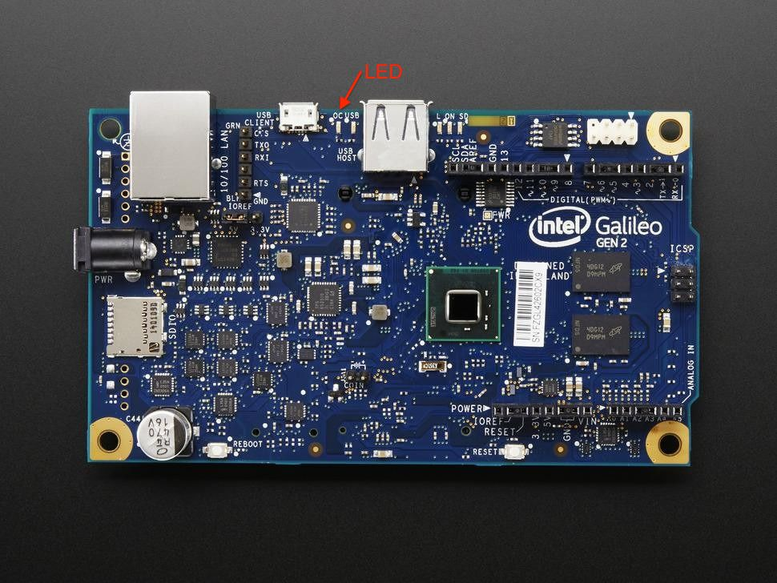

# Programming Galileo Gen2 GPIO

## Introduction

This repository contains an example for using Helix App Cloud on the Intel Galileo Gen2 board running VxWorks-7 OS to manipulate GPIO pins. It's a quick tutorial that allows you to quickly get up to speed on how to use GPIO on VxWorks-7 based platforms.

## GPIO for VxWorks-7

VxWorks-7 uses the same interface to GPIO as recent versions of Linux based on sysfs, in particular /sys/class/gpio.  There is an excellent overview describing how to use GPIO from a Linux application at [Kernel.org Documentation](https://www.kernel.org/doc/Documentation/gpio/sysfs.txt).  VxWorks-7 implements the same interface; however, the underlying implementation is quite different. From the perspective of writing C/C++ application programs, they are the same.

The steps to read/write a GPIO pin are relatively simple:

### Step 1 - Reserve/Create the Pin

Following the Linux GPIO interface we first have to create the pin using /sys/class/gpio. We do this by writing the string value of the pin number (e.g.: "30") to /sys/class/gpio/export.

```C
int fd;
char buf[MAX_BUF]; 
int gpio = 30;

fd = open("/sys/class/gpio/export", O_WRONLY);
sprintf(buf, "%d", gpio); 
write(fd, buf, strlen(buf));

close(fd);
```
### Step 2 - Set the Pin Direction

GPIO pins are either inputs or outputs.  When set as an input, a read() operation will return whatever logic level is presented by external circuitry when the read happens.  When set as an output, a write() operation will set the pin to whatever logic level is desired. (There are also cases where a read() of a pin set as output just returns whatever was last written; but, let's not get too ahead of ourselves.)  We set the direction via sysfs:

```C
int fd;
char buf[MAX_BUF]; 
int gpio = 30;

sprintf(buf, "/sys/class/gpio/gpio%d/direction", gpio);

fd = open(buf, O_WRONLY);

write(fd, "in", 2);         // Set as an input
write(fd, "out", 3);        // Set as an output

close(fd);
```
### Step 3a - Set the Output Value

If the GPIO is set as an output, the write() function will allow setting it to either a logic 0 or logic 1.  The actual voltage will vary based on the design of your hardware; however, that really only matters to the people wiring boards and devices together.  Here's some code to set the pin to a logic 1 followed by a logic 0, 5 seconds apart:

```C
int fd;
char buf[MAX_BUF]; 
int gpio = 30;

sprintf(buf, "/sys/class/gpio/gpio%d/value", gpio);

fd = open(buf, O_WRONLY);

write(fd, “1”, 1);             // Set GPIO pin high
sleep(5);
write(fd, "0", 1);             // Set GPIO pin low

close(fd);
```
### Step 3b - Read an Input

Alternatively, if the GPIO is configured for input, you can read the current logic level at the pin with the following code:

```C
int fd;
char buf[MAX_BUF]; 
int gpio = 35;

sprintf(buf, "/sys/class/gpio/gpio%d/value", gpio);

fd = open(buf, O_RDWR);

read(fd, &buf, 1);              // Read the value of Pin 35

close(fd);
```
### Step 4 - Deallocate the GPIO

Let's not forget to give the GPIO back when we're done using it.  We use the sysfs "unexport" capability to accomplish this.

```C
int fd;
char buf[MAX_BUF]; 
int gpio = 31;

fd = open("/sys/class/gpio/unexport", O_WRONLY);

sprintf(buf, "%d", gpio);

write(fd, buf, strlen(buf));

close(fd);
```

OK, now you know everything there is to know about GPIO on VxWorks-7.  Let's put it to use by blinking a LED!

## Blinky

The _Blinky_ demo turns the LED attached to IO Pin 13 on and off.   All you need to run this demo is the basic Galileo Gen2 board.  Most of the pins on the Galileo Gen2 Arduino interface have multiple functions.  Pin 13 is no exception.  So, before we can start blinking the LED we need to get the proper signals routed to the pin.  This table shows the setup:

| GPIO PIN | Direction | Value  |
|:--------:|:---------:|:------:|
|30        | Output    | 0      |
|46        | Output    | 0      |
|07        | Output    | LED    | 

In order to reduce the amount of typing required, the _Blinky_ demo provides a few functions to perform repetitive functions.  These are implemented in gpioutils.c:

* __int gpio_alloc(int gpionum)__ - Allocates (exports) the requested GPIO
* __int gpio_dealloc(int gpionum)__ - Deallocates (unexports) the requested GPIO
* __int gpio_set_direction(int gpionum, char *direction)__ - Set the request GPIO pin to either "in" or "out"
* __int gpio_write_pin(int gpionum, char *value)__ - Sets the requested GPIO output pin to logic "1" or "0"
 
All of these functions return a 0 if they succeed or non-zero if they fail.


### Step 1 - Allocate the Required Pins

According to our table, we need three GPIO pings to blink the LED: 30, 46, and 7.  The first block of code allocates them:

```C
 if (gpio_alloc(30))    /* Create /sys/class/gpio/gpio30 (Internal MUX) */
        err_exit();
        
    if (gpio_alloc(46))    /* Create /sys/class/gpio/gpio46 (Internal MUX) */
        err_exit();
        
    if (gpio_alloc(7))    /* Create /sys/class/gpio/gpio7  (Arduino IO13) */
        err_exit();
        
```
### Step 2 - Set the GPIO Pin Direction and Value

Now that we have the GPIO pins, we need to set pins 30 and 46 to both be outputs and logic 0.  Additionally, we need to set GPIO 7 to an output since it's actually hooked up to the LED:

```C
   if (gpio_set_direction(30, "out"))
        err_exit();
    
    if (gpio_write_pin(30, "0"))
        err_exit();
```
You will find the same code for GPIO 46 and GPIO 7 in main.c.

### Step 3 - Let's Blink

Finally, GPIO 7 is the signal that actually connects to IO13 and the LED on the Galileo board.  By repetively calling gpio_write_pin() with some delay in between we get the blinking LED:

```C
  for (i=0; i < 10; i++)
        {
        if (gpio_write_pin(7, "0"))    /* Turn the LED off */
            err_exit();

        sleep(1);                      /* Wait ~1 second */
        
        if (gpio_write_pin(7, "1"))    /* Turn the LED on */
            err_exit();

        sleep(1);
        }
```
### Step 4 - Wait a minute I can't see it!

Before you panic look carefully for the surface mount LED next to the USB host connector (the big USB connector).  The LED is buried in there. 




## Further Reading

Most of the physical pins on the Galileo Gen2 Board can perform more than one function.  The GPIO device driver is used to "steer" signals through various multiplexers and level-shifters to accomplish this.  Here are some good references:

* [Emutex Labs Getting Started With Intel Galileo Gen 2](http://www.emutexlabs.com/component/content/article?id=203:getting-started-with-intel-galileo-gen-2) This is a great page that describes how to use the board from Arduino or Linux.  VxWorks-7 follows what it says about Linux.
* [Galileo Gen2 Schematics](http://download.intel.com/support/galileo/sb/galileo_fabh_schem_120514.pdf) for those like "Luke" that "use the source".   


